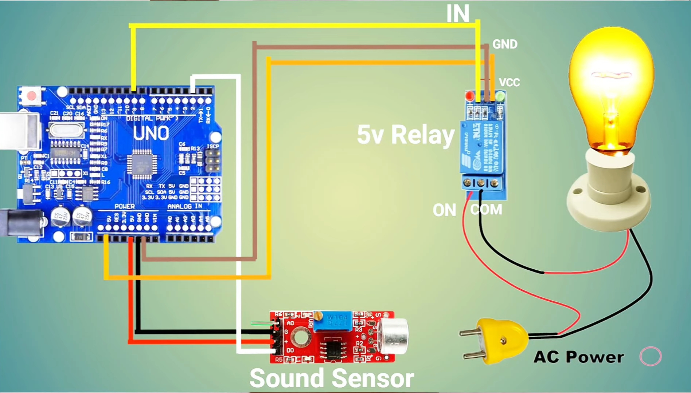

# Arduino Clap Light Switch 🔊💡

This Arduino project turns lights on/off by detecting **two claps** using a microphone sensor.

🎥 Watch the full video on YouTube: [Gadget Maker BD](https://youtu.be/3grnVwB09WQ?si=ReMQQ3sA5j6RbdNS)  
📁 Code maintained by: Gadget Maker BD

---

## 🧰 Components Used

- Arduino Uno (or compatible)
- Microphone sound sensor module
- Relay module (to control light)
- LED (for indication)
- Jumper wires
- Breadboard or PCB

---

## 🖼️ Circuit Diagram

---

## 📝 How It Works

- The microphone detects **claps** as sound pulses.
- If **two claps** are detected within a short time (but spaced out enough), the relay toggles.
- LED on pin 13 indicates clap detection.
